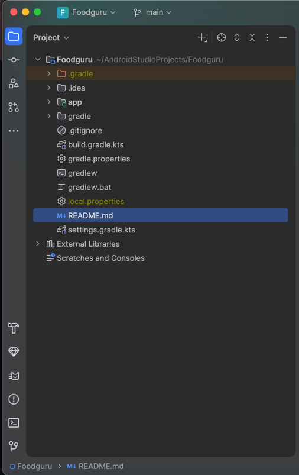

# Foodguru
---
## Description

This is an app for finding recipes from the internet database with step‑by‑step instructions 
for preparing them and for creating new, custom recipes (a local recipe book). The problem this app 
solves is fundamental and often plagues many people, including myself — “what to cook?”.

## Functionality list
1. User can browse recipes
2. User can create/edit/delete recipe
3. App persist user’s created and saved recipes locally
4. App shows recipe of the day
5. App shows recipe details with photo, ingredients, description and cooking instructions
6. App shows user profile, from which he can access 2 basic lists of all user’s created and liked recipes
7. User can create new lists of his recipes (for example breakfasts, dinner, etc.)

## Current folder structure

## Basic build run instruction
To build and run app, follow these steps:

1. Install Android SDK Platforms tools and either connect android smartphone with USB debuggin enabled or use Android Emulator.
2. Verify your device is connected `adb devices`.
3. Install the app. `adb install path/to/your_app.apk`.
4. Run the app `adb shell am start -n com.example.myapp/com.example.myapp.MainActivity`.