# Foodguru
---
## Description

This is an app for finding recipes from the internet database with step‑by‑step instructions 
for preparing them and for creating new, custom recipes (a local recipe book). The problem this app 
solves is fundamental and often plagues many people, including myself — “what to cook?”.

## Functionality list
1. User can browse recipes
2. User can create/edit/delete recipe
3. App persist user’s created and saved recipes locally
4. App shows recipe of the day
5. App shows recipe details with photo, ingredients, description and cooking instructions
6. App shows user profile, from which he can access 2 basic lists of all user’s created and liked recipes
7. User can create new lists of his recipes (for example breakfasts, dinner, etc.)

## Current folder structure
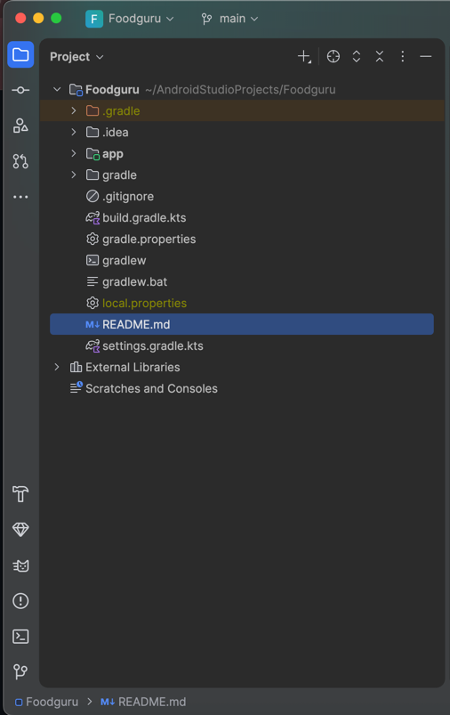

## Screen wireframes

    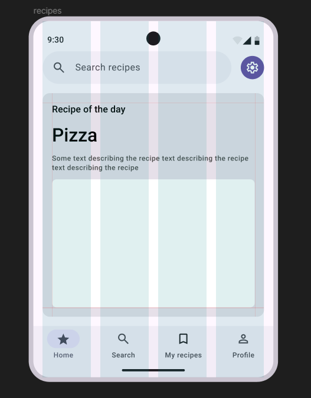
    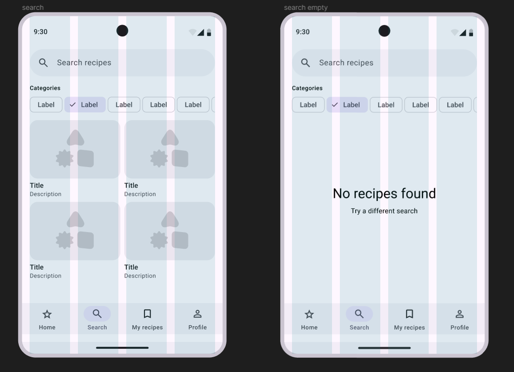
    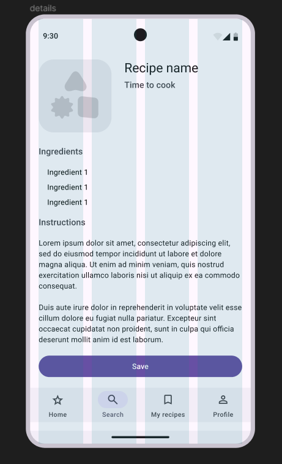

## Screen layouts

    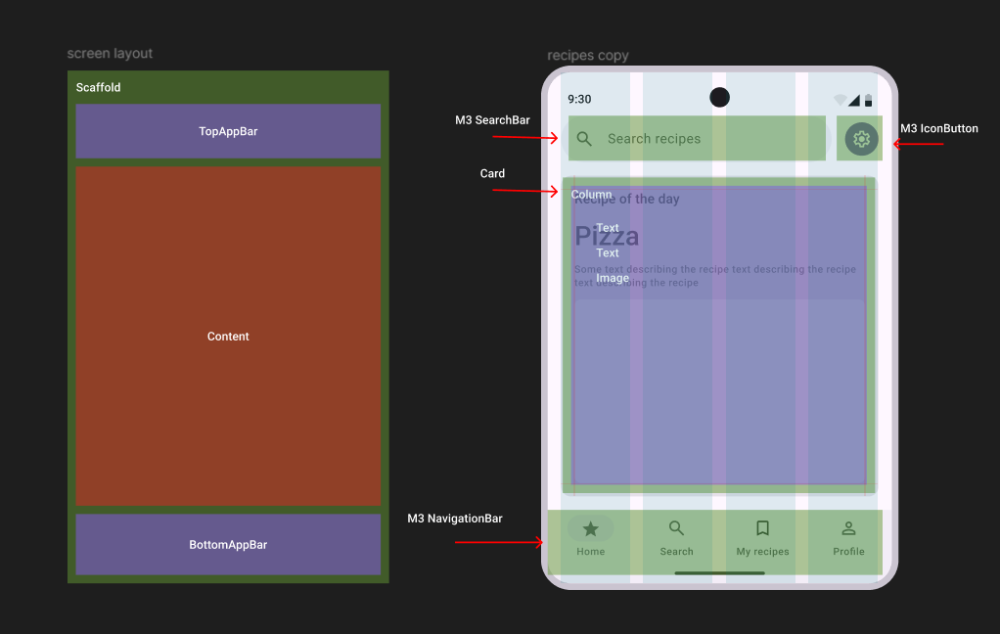
    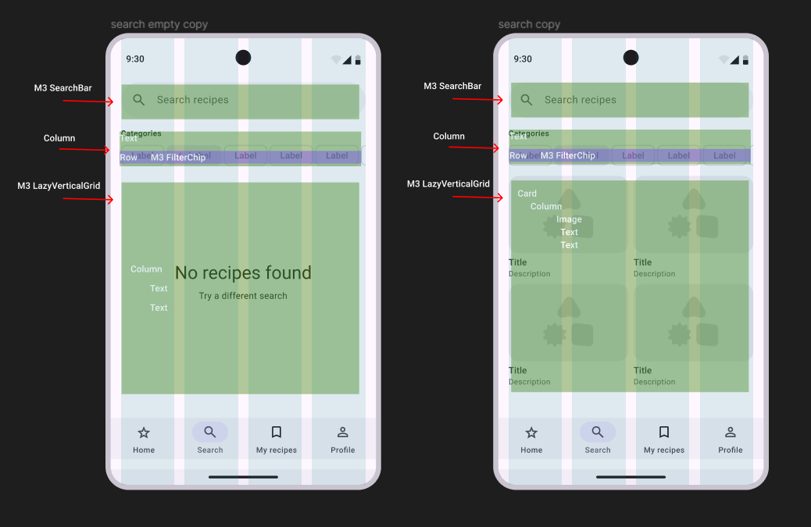
    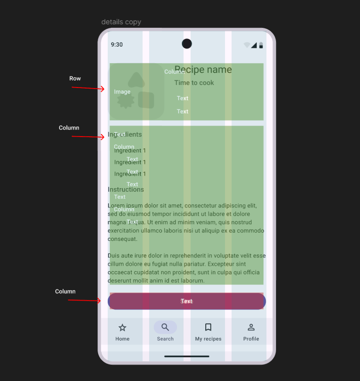

## Screens light theme

    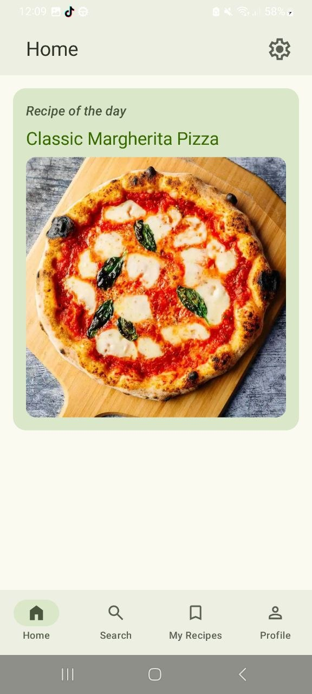
    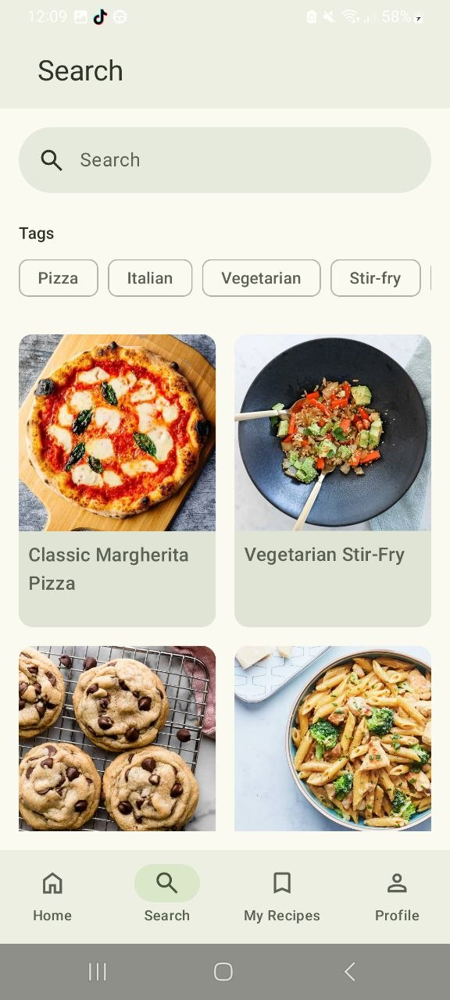
    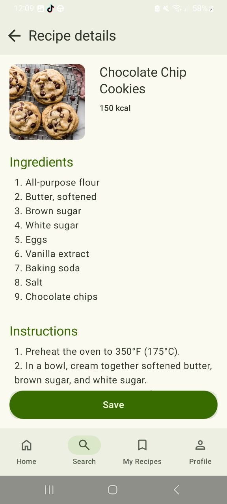

## Screens dark theme

    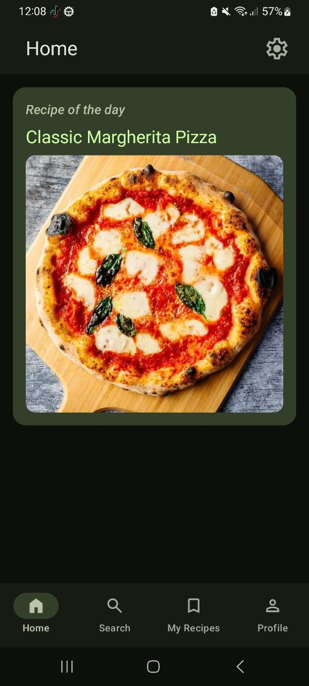
    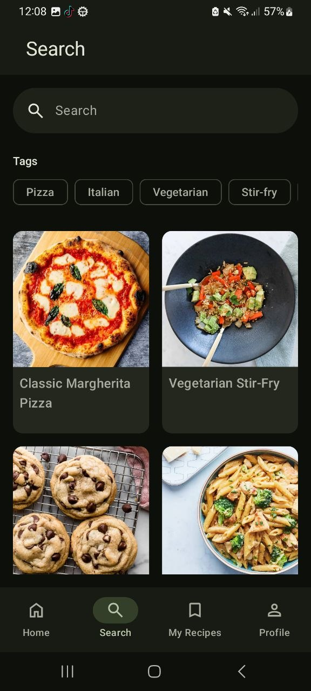
    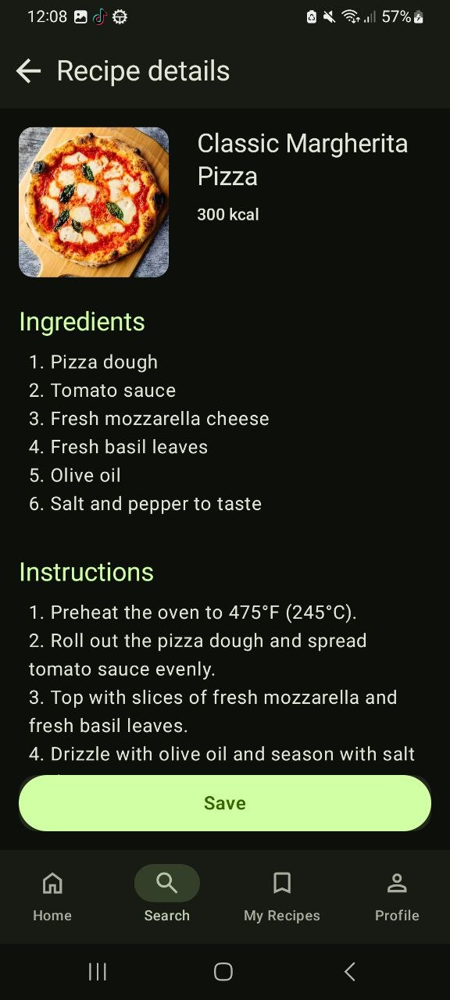

## App architecture
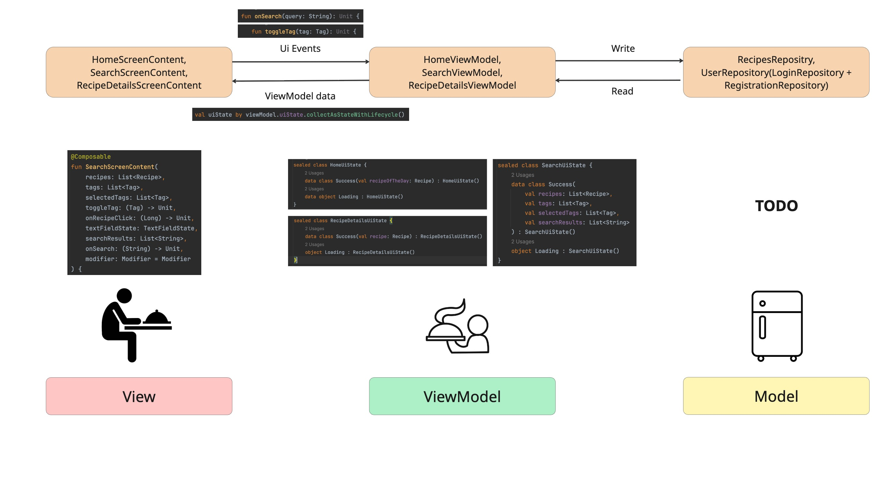

#### Trace one click
When the user on search screen taps the recipe card, the functions (events) are being invoked in this order:
RecipeListCard:onClick -> SearchScreenContent:onRecipeClick -> SearchScreen:viewModel.onSearch(query)
ViewModel's onSearch edits TextFieldState.text, triggering StateFlow emit updating uiState, showing new recipes list.

## Basic build run instruction
To build and run app, follow these steps:

1. Open Android Studio
2. Connect android device with debugging mode activated, or create a virtual device.
3. Click build app button

